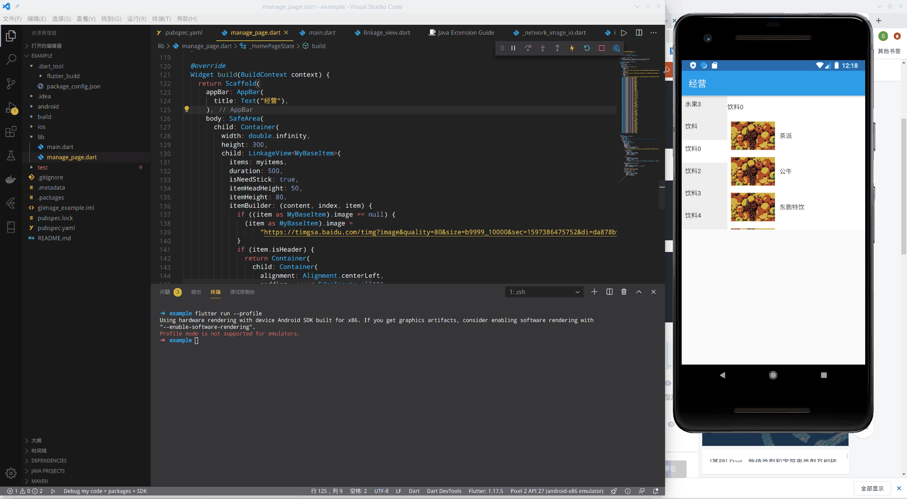

# LinkageView

联动的双排listview,应用在菜单列表中.可以设置粘性头部和自定义各个item.

## Getting Started



```dart
import 'package:flutter/material.dart';

import 'linkage_view.dart';


/// 经营
class HomePage extends StatefulWidget {
  @override
  _HomePageState createState() => _HomePageState();
}

class MyBaseItem extends BaseItem {
  MyBaseItem({bool isHeader, String header, dynamic info, String title})
      : super(isHeader: isHeader, header: header, info: info, title: title);
}

class _HomePageState extends State<HomePage> {
  List<MyBaseItem> myitems;
  @override
  void initState() {
    // TODO: implement initState
    super.initState();
    myitems = [
      MyBaseItem(isHeader: true, header: "水果"),
      MyBaseItem(isHeader: false, title: "苹果"),
      MyBaseItem(isHeader: false, title: "香蕉"),
      MyBaseItem(isHeader: false, title: "西瓜"),
      MyBaseItem(isHeader: false, title: "菠萝"),
      MyBaseItem(isHeader: true, header: "水果2"),
      MyBaseItem(isHeader: false, title: "苹果"),
      MyBaseItem(isHeader: false, title: "香蕉"),
      MyBaseItem(isHeader: false, title: "西瓜"),
      MyBaseItem(isHeader: false, title: "菠萝"),
      MyBaseItem(isHeader: false, title: "哈密瓜"),
      MyBaseItem(isHeader: false, title: "桃子"),
      MyBaseItem(isHeader: true, header: "水果3"),
      MyBaseItem(isHeader: false, title: "龙眼"),
      MyBaseItem(isHeader: false, title: "荔枝"),
      MyBaseItem(isHeader: false, title: "火龙果"),
      MyBaseItem(isHeader: false, title: "柚子"),
      MyBaseItem(isHeader: false, title: "葡萄"),
      MyBaseItem(isHeader: false, title: "草莓"),
      MyBaseItem(isHeader: false, title: "蓝莓"),
      MyBaseItem(isHeader: false, title: "梨子"),
      MyBaseItem(isHeader: false, title: "百香果"),
      MyBaseItem(isHeader: true, header: "饮料"),
      MyBaseItem(isHeader: false, title: "农夫山泉"),
      MyBaseItem(isHeader: false, title: "王老吉"),
      MyBaseItem(isHeader: false, title: "加多宝"),
      MyBaseItem(isHeader: false, title: "农夫山泉"),
      MyBaseItem(isHeader: false, title: "王老吉"),
      MyBaseItem(isHeader: false, title: "加多宝"),
      MyBaseItem(isHeader: false, title: "农夫山泉"),
      MyBaseItem(isHeader: false, title: "王老吉"),
      MyBaseItem(isHeader: false, title: "加多宝"),
      MyBaseItem(isHeader: false, title: "农夫山泉"),
      MyBaseItem(isHeader: false, title: "王老吉"),
      MyBaseItem(isHeader: false, title: "加多宝"),
      MyBaseItem(isHeader: true, header: "饮料0"),
      MyBaseItem(isHeader: false, title: "茶派"),
      MyBaseItem(isHeader: false, title: "公牛"),
      MyBaseItem(isHeader: false, title: "东鹏特饮"),
      MyBaseItem(isHeader: false, title: "矿泉水"),
      MyBaseItem(isHeader: false, title: "奶茶"),
      MyBaseItem(isHeader: false, title: "椰汁"),
      MyBaseItem(isHeader: false, title: "柠檬茶"),
      MyBaseItem(isHeader: false, title: "AD钙奶"),
      MyBaseItem(isHeader: true, header: "饮料2"),
      MyBaseItem(isHeader: false, title: "农夫山泉"),
      MyBaseItem(isHeader: false, title: "王老吉"),
      MyBaseItem(isHeader: false, title: "加多宝"),
      MyBaseItem(isHeader: false, title: "茶派"),
      MyBaseItem(isHeader: false, title: "公牛"),
      MyBaseItem(isHeader: false, title: "东鹏特饮"),
      MyBaseItem(isHeader: false, title: "矿泉水"),
      MyBaseItem(isHeader: false, title: "奶茶"),
      MyBaseItem(isHeader: false, title: "椰汁"),
      MyBaseItem(isHeader: false, title: "柠檬茶"),
      MyBaseItem(isHeader: false, title: "AD钙奶"),
      MyBaseItem(isHeader: true, header: "饮料3"),
      MyBaseItem(isHeader: false, title: "农夫山泉"),
      MyBaseItem(isHeader: false, title: "王老吉"),
      MyBaseItem(isHeader: false, title: "加多宝"),
      MyBaseItem(isHeader: false, title: "茶派"),
      MyBaseItem(isHeader: false, title: "公牛"),
      MyBaseItem(isHeader: true, header: "饮料4"),
      MyBaseItem(isHeader: false, title: "东鹏特饮"),
      MyBaseItem(isHeader: false, title: "矿泉水"),
      MyBaseItem(isHeader: false, title: "奶茶"),
      MyBaseItem(isHeader: false, title: "椰汁"),
      MyBaseItem(isHeader: false, title: "柠檬茶"),
      MyBaseItem(isHeader: false, title: "AD钙奶"),
      MyBaseItem(isHeader: true, header: "饮料5"),
      MyBaseItem(isHeader: false, title: "东鹏特饮"),
      MyBaseItem(isHeader: false, title: "矿泉水"),
      MyBaseItem(isHeader: false, title: "奶茶"),
      MyBaseItem(isHeader: false, title: "椰汁"),
      MyBaseItem(isHeader: false, title: "柠檬茶"),
      MyBaseItem(isHeader: false, title: "AD钙奶"),
      MyBaseItem(isHeader: true, header: "饮料6"),
      MyBaseItem(isHeader: false, title: "东鹏特饮"),
      MyBaseItem(isHeader: false, title: "矿泉水"),
      MyBaseItem(isHeader: false, title: "奶茶"),
      MyBaseItem(isHeader: false, title: "椰汁"),
      MyBaseItem(isHeader: false, title: "柠檬茶"),
      MyBaseItem(isHeader: false, title: "AD钙奶"),
    ];
  }

  @override
  Widget build(BuildContext context) {
    return Scaffold(
      appBar: AppBar(
        title: Text("经营"),
      ),
      body: SafeArea(
        child: Container(
          width: double.infinity,
          height: 300,
          child: LinkageView<MyBaseItem>(
            items: myitems,
            duration: 500,
            isNeedStick: true,
            itemHeadHeight: 50,
            itemHeight: 80,
            itemBuilder: (content, index, item) {
              if (item.isHeader) {
                return Container(
                    child: Container(
                        child: Container(
                            padding: const EdgeInsets.all(0), color: Colors.grey[100], child: Text(item.header))));
              } else {
                return Container(padding: const EdgeInsets.all(8), color: Colors.green[100], child: Text(item.title));
              }
            },
            groupItemBuilder: (content, index, item) {
              return Container(
                height: 50,
                padding: const EdgeInsets.all(8),
                color: item.isSelect ? Colors.blue[100] : Colors.green[100],
                child: Text(item.header),
              );
            },
            onGroupItemTap:(content, index, item) {
              print("tab is ${item.header} click");
            },
            headerBuilder: (content, item) {
              return Container(
                color: Colors.yellow[100],
                child: new Text(item.header),
              );
            },
          ),
        ),
      ),
    );
  }
}


```